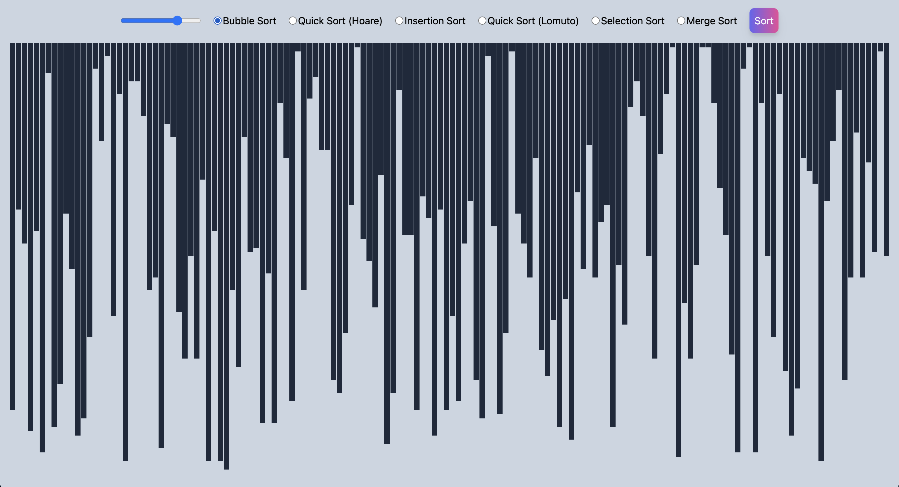

# Sorting Visualizer

## Introduction

Welcome to the Sorting Visualizer! This is an interactive tool designed to demonstrate how various sorting algorithms operate. Built with React, JavaScript, Vite, and Tailwind CSS, this project serves as a practical way to understand and visualize the mechanics behind sorting algorithms in real-time.



## Features

- **Interactive Visualization:** Watch sorting algorithms in action and understand their step-by-step process.
- **Multiple Algorithms:** Currently supports:
  1. Bubble Sort
  2. Merge Sort
  3. Quick Sort (Hoare Partition Scheme)
  4. Selection Sort
  5. Quick Sort (Lomuto Partition Scheme)
  6. Insertion Sort
- **Built with Modern Tools:** Utilizes the latest in web development technologies for a seamless experience.

## Project Demo

[Sorting Visualizer Live Demo]()

## Installation and Setup

### Prerequisites

- **Node.js:** Ensure Node.js is installed on your system. Verify this by running `node -v` in your terminal. If not installed, download it from the [Node.js](https://nodejs.org/) official website.
- **Package Manager:** This project uses [pnpm](https://pnpm.io/installation) for managing dependencies.

### Steps

1. **Clone the Repository:**

    ```bash
    git clone ""
    ```

2. **Navigate to the Project Directory:**

   ```bash
   cd sorting-visualizer

3. **Install Dependencies:**
   ``` pnpm i

4. **Launch the Development Server:**
   ```pnpm run dev